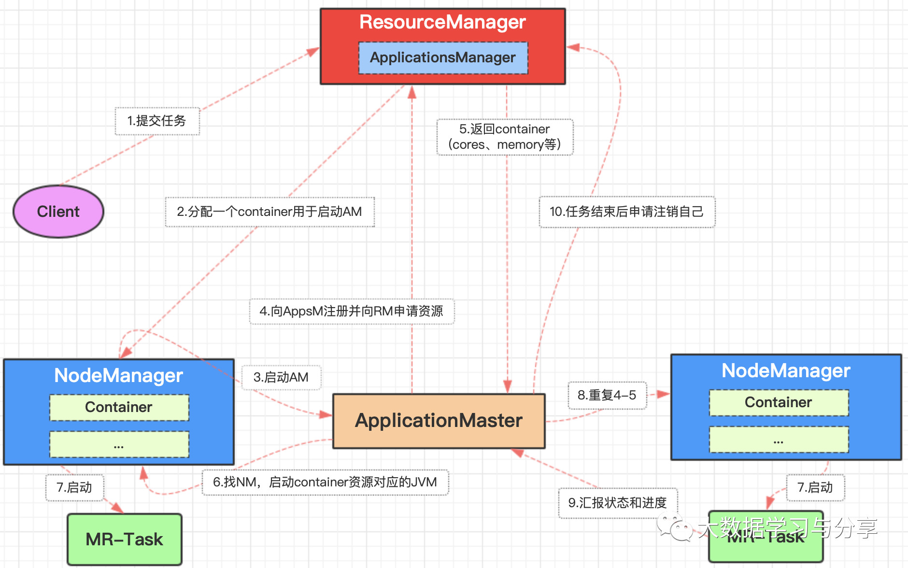
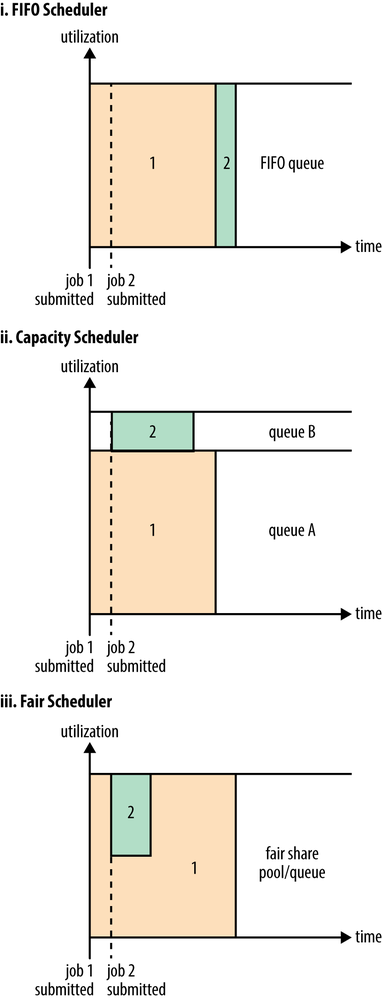

## 不可不知的资源管理调度器Hadoop Yarn
	
Yarn（Yet Another Resource Negotiator）是一个资源调度平台，负责为运算程序如Spark、MapReduce分配资源和调度，不参与用户程序内部工作。同样是Master/Slave架构。

以下图MapReduce提交到Yarn上运行为例，看看Yarn主要包括哪些核心组件以及每个组件的作用：

### 全局资源管理器（ResourceManager）

主节点，全局资源管理器，负责整个系统的资源管理和分配，主要由调度器和应用程序管理器组成。

调度器根据容量、队列等限制条件（如每个队列分配多少资源、最多执行一定数量的作业等）将系统中资源分配给各个正在运行的应用程序。

应用程序管理器（ApplicationsManager）负责管理整个系统中所有应用程序，包括应用程序提交、与调度器协商资源以启动、监控Application Master，并且在失败时重新启动它等

### 节点资源管理器（NodeManager） 

从节点，每个节点上的资源和任务管理器，它需要向ResourceManager汇报本节点上的资源使用情况和各个Container的运行状态，同时接收并处理来自Application Master的Container启动/停止等各种请求

### 应用管理器（Application Master）

用户提交的每个应用程序均包含1个应用管理器，对应到运行MapReduce为MRAppMaster，主要功能包括：

1. 向全局资源管理器申请资源

2. 将得到的资源进一步分配给内部的任务

3. 与节点资源管理器通信以启动/停止任务

4. 监控所有任务运行状态，并在任务运行失败时重新为任务申请资源以重启任务

### Container

可以理解为Yarn中为某个节点已经申请到的资源封装的类，资源如内存、CPU等，是根据应用程序需求动态生成的，是Yarn中基本资源划分单位。一个NodeManager节点上同时存在多个Container。提交作业的每个task都运行在Container中

### Yarn调度器

根据一些限制条件如每个队列分配多少资源、最多执行多少数量的作业，将系统中资源按照应用程序的资源需求分配给各个应用程序，资源分配单位就是上文提到的container，并且用户可以根据自己的需求设计新的调度器，目前Yarn也提供了多种可直接使用的调度器：

FIFOScheduler（先进先出调度器）：不支持抢占先机。如果有运行特别慢的任务，会影响其他任务

FairScheduler（公平调度器）：每个用户公平共享集群资源，支持抢占先机，如果有的任务长时间占用大量资源，超出其应该分配的资源比例，会终止得到过多资源的任务

CapacityScheduler（容量调度器）：有层次结构的队列，每个队列分配一定的容量（比如将小job和大job分配到不同的队列），单个队列内部支持FIFO

#### 笔者强调

1. Yarn并不清楚用户提交程序的运行机制，只提供运算资源的调度（用户程序向yarn申请资源，yarn负责分配资源）

2. Yarn中的主管角色是ResourceManager，具体提供运算资源的角色是NodeManager

3. Yarn与运行的用户程序完全解耦，意味着Yarn上可以运行各种类型的分布式运算程序，如Spark、MapReduce、
Storm、Tez等，前提是这些技术框架中有符合Yarn规范的资源请求机制即可

4. 因为Yarn不参与用户程序的执行等，使得Yarn成为一个通用的资源调度平台。企业中以前存在的各种计算引擎集群都可以整合在一个资源管理平台上，提高资源利用率

5. 调度器不参与任何与具体应用程序相关的工作，如不负责监控或者跟踪应用的执行状态等，也不负责重新启动因应用执行失败或者硬件故障而产生的失败任务，这些均交由应用程序相关的Application Master完成。

### [阅读原文](https://mp.weixin.qq.com/s/ebssHErHzfbcb7zKTxykvQ)