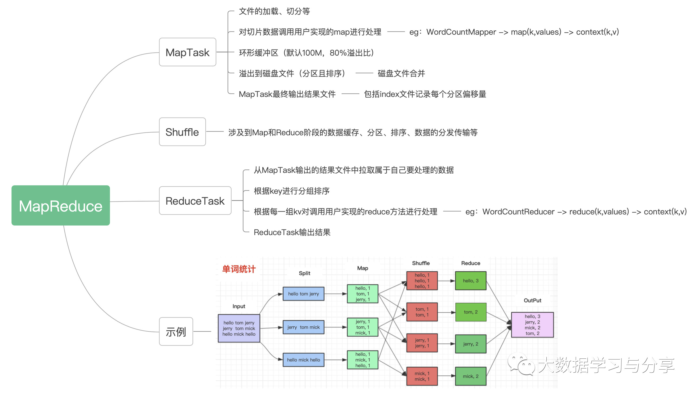
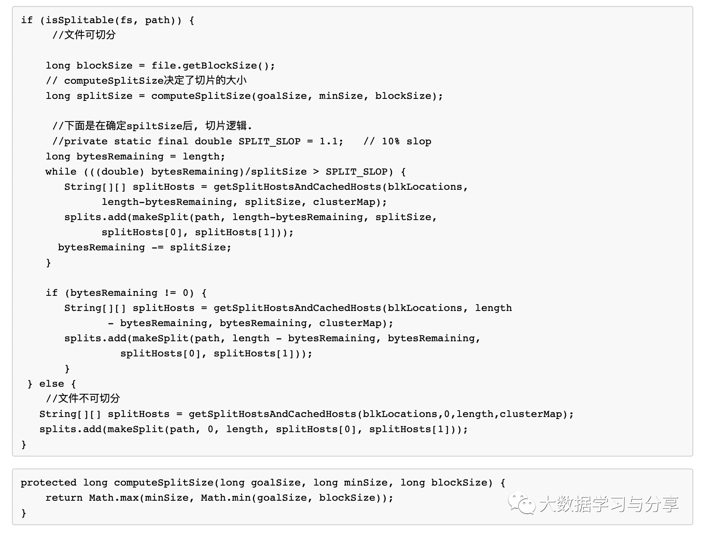
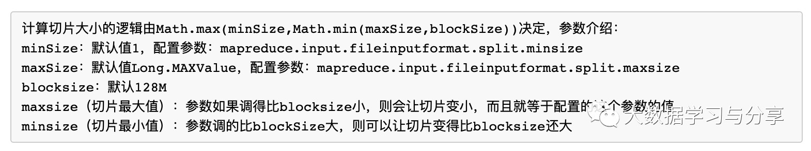

## 详解MapReduce（Spark和MapReduce对比铺垫篇）

本来笔者是不打算写MapReduce的，但是考虑到目前很多公司还都在用这个计算引擎，以及后续要讲的Hive原生支持的计算引擎也是MapReduce，并且为Spark和MapReduce的对比做铺垫，笔者今天详细阐述一下MapReduce。鉴于Hadoop1.X已过时，Hadoop3.X目前用的还不多，企业中目前大量运用的还是Hadoop2.X，所以以下都是基于Hadoop2.X版本的MapReduce（后续要讲的HDFS和Yarn也是）。

MapReduce是Hadoop核心三剑客之一，设计思想来源于谷歌三篇论文之一的《分布式计算模型》。作为一个分布式运算程序编程框架，需要用户实现业务逻辑代码并和它自带的默认组件整合成完整的分布式运算程序，并发运行在Hadoop集群上。一个完整的MapReduce程序在分布式运行时有三类实例进程：
   
1. MRAppMaster：负责整个程序过程调度及状态协调  
2. MapTask：负责map阶段整个数据处理流程  
3. ReduceTask：负责reduce阶段整个数据处理流程

这里笔者还是要强调一点：MapTask和ReduceTask是进程级别，这一点很重要！

笔者画了一张MapReduce处理的流程图，并以处理单词统计的例子作为示例：

<p align="center">

</p>


MapReduce处理数据主要分为两个阶段：map和reduce，对应到上图分别对应的处理实例就是MapTask和ReduceTask。数据处理先进内存然后刷磁盘，虽然有溢出比限制，但是笔者强调，落磁盘至少一次，通过上图以及接下来的讲解明白了MapReduce的整个处理流程、细节也就能掌握shuffle阶段都干了什么。

下面就图说说里面核心的机制和涉及的组件：

### 切片机制

切片也就是把文件切成一个个block块，但是此处的切片是逻辑切片而非物理切片。切片的逻辑可以查看接口InputFormat<K, V>的getSplits方法，通过它的一个实现类FileInputFormat看看切片的默认实现机制，直接看源码：
<p align="center">

</p>

这里咱们主要关注文件可切分的部分，通过分析源码，在FileInputFormat中，默认切片机制如下：  
1. 简单的按照文件的内容长度进行切片  
2. 切片大小，默认等于block大小   
3. 切片时不考虑数据集整体，而是逐个针对每一个文件单独切片
 
<p align="center">

</p>


因此默认情况下，切片大小等于blocksize。但是，不论怎么调参数，都不能让多个小文件“划入”一个split, 会影响性能, 后续讲HDFS时会说明一下小文件的问题。

了解完切片机制之后，初学者容易陷入一个误区，就是比如我配置blocksize为128M，那么我一个文件就会按照128M等比例切分，切到最后不足128M部分单独作为一个切片，但笔者强调这是要分情况的。其实细心的小伙伴会看到我源码截图中的注释部分，关键的参数SPLIT_SLOP为1.1，同样以blocksize为128M为例，假如对于一个130M的可切分文件会产生几个block块呢？很显然130 < 128*1.1，就产生一个切片为130M的block，所以多看源码很重要。

### MapReduce并行度决定机制

1）MapTask并行度决定机制

了解了切片机制，就很容易了解MapTask的并行度机制了，因为MapTask的并行度主要取决于切片机制。一个任务的map阶段并行度由客户端在提交任务时决定，而客户端对map阶段并行度的规划的基本逻辑为：按照一个特定切片大小，将待处理数据划分成逻辑上的多个切片，然后每一个切片分配一个mapTask并行实例处理

2）ReduceTask并行度决定机制

ReduceTask设置方式就很简单了，可以直接手动设置：job.setNumReduceTasks(4);，默认值是1，手动设置为4。ReduceTask的并行度同样影响整个任务的执行效率，如果数据分布不均匀，就有可能产生数据倾斜。

注意：ReduceTask设置方式就很简单了，可以直接手动设置：数量并不是任意设置，还要考虑业务逻辑需求，有些情况下，需要计算全局汇总结果，就只能有1个ReduceTask设置方式就很简单了，可以直接手动设置：。尽量不要运行太多的ReduceTask。对大多数任务来说，最好reduce的个数最多和集群中的reduce持平，或者比集群的reduce slots小。这个对于小集群而言，尤其重要。

并发数的选择受多方面因素影响，比如运算节点的硬件配置、运算任务的类型：CPU密集型还是IO密集型、运算任务的数据量，这个还是要根据实际情况而定。

3）map|reduce端核心组件

```
a) partitioner组件
  
  在map输出数据溢出到磁盘之前调用。默认根据key.hashcode%reduce数量(HashPartition)，可以自
  定义分区组件
  		
b) combiner组件（继承了Reducer）

  在map环形缓冲区、reduce输入缓冲区溢出到磁盘之前、多个溢出文件合并时调用。目的是减少写磁盘的数
  据量(磁盘IO)和传递给reduce的数据量(带宽)。慎用：调用次数不一定，不能影响核心业务逻辑，如对数
  据求平均值：
  
	2  5  6：加入combiner，2+5+6/3=13/3
	4  3 ：加入combiner，4+3/2=7/2，最终(13/3+7/2)/2 = 47/12
	不加combiner组件：2+5+6+4+3/5 = 4

c) 分组
   reduce阶段合并数据的规则，默认根据key相同分为一组
	/**利用reduce端的GroupingComparator来实现将一组bean看成相同的key */
	public class ItemidGroupingComparator extends WritableComparator {
    	//传入作为key的bean的class类型，以及制定需要让框架做反射获取实例对象
   		protected ItemidGroupingComparator() {
            		super(Order.class,true);
    	}
    	@Override
    	public int compare(WritableComparable a, WritableComparable b) {
            		//强转
            		Order aBean = (Order) a;
            		Order bBean = (Order) b;
            		//比较两个bean时，指定只比较bean中itemId
       		return aBean.getItemId().compareTo(bBean.getItemId());
	    }
	}

```

最后再说一下MapReduce的分布式缓存：MapReduce通过DistributedCache，可以将job指定的文件，在job执行前，先行分发到task执行的机器上，并提供相关机制对cache文件进行管理。但需要注意：需要分发的文件，必须提前放到hdfs上；需要分发的文件在任务运行期间最好是只读的；不建议分发较大的文件，影响性能。主要用来分发第三方库、多表数据join时小表数据简便处理等。可以在自定实现Mapper类，重写setup方法中进行分布式缓存处理。

对于MapReduce分布式缓存，很类似于Spark中的广播变量，后续讲到Spark广播变量和累计变量时再细说。

### [阅读原文](https://mp.weixin.qq.com/s/TRn4iouzBDmNz62LxyO-lg)