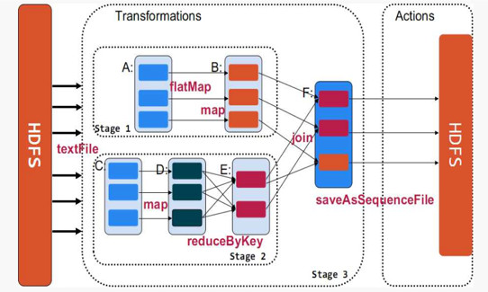

## Spark RDD 详解

RDD（Resilient Distributed Datasets）弹性的分布式数据集，又称Spark core，它代表一个只读的、不可变、可分区，里面的元素可分布式并行计算的数据集。

RDD是一个很抽象的概念，不易于理解，但是要想学好Spark，必须要掌握RDD，熟悉它的编程模型，这是学习Spark其他组件的基础。笔者在这里从名字和几个重要的概念给大家一一解读：

#### Resilient（弹性的）

提到大数据必提分布式，而在大规模的分布式集群中，任何一台服务器随时都有可能出现故障，如果一个task任务所在的服务器出现故障，必然导致这个task执行失败。此时，RDD的"弹性的"特点可以使这个task在集群内进行迁移，从而保证整体任务对故障服务器的平稳过渡。对于整个任务而言，只需重跑某些失败的task即可，而无需完全重跑，大大提高性能

#### Distributed（分布式）

首先了解一下分区，即数据根据一定的切分规则切分成一个个的子集。spark中分区划分规则默认是根据key进行哈希取模，切分后的数据子集可以独立运行在各个task中并且在各个集群服务器中并行执行。当然使用者也可以自定义分区规则，这个还是很有应用场景的，比如自定义分区打散某个key特别多的数据集以避免数据倾斜（数据倾斜是大数据领域常见问题也是调优重点，后续会单独讲解）

#### Datasets（数据集）

初学者很容易误解，认为RDD是存储数据的，毕竟从名字看来它是一个"弹性的分布式数据集"。但是，笔者强调，RDD并不存储数据，它只记录数据存储的位置。内部处理逻辑是通过使用者调用不同的Spark算子，一个RDD会转换为另一个RDD（这也体现了RDD只读不可变的特点，即一个RDD只能由另一个RDD转换而来），以transformation算子为例，RDD彼此之间会形成pipeline管道，无需等到上一个RDD所有数据处理逻辑执行完就可以立即交给下一个RDD进行处理，性能也得到了很大提升。但是RDD在进行transform时，不是每处理一条数据就交给下一个RDD，而是使用小批量的方式进行传递（这也是一个优化点）

#### lineage

既然Spark将RDD之间以pipeline的管道连接起来，如何避免在服务器出现故障后，重算这些数据呢？这些失败的RDD由哪来呢？这就牵涉到，Spark中的一个很重要的概念：Lineage即血统关系。它会记录RDD的元数据信息和依赖关系，当该RDD的部分分区数据丢失时，可以根据这些信息来重新运算和恢复丢失的分区数据。简单而言就是它会记录哪些RDD是怎么产生的、怎么“丢失”的等，然后Spark会根据lineage记录的信息，恢复丢失的数据子集，这也是保证Spark RDD弹性的关键点之一。

## Spark缓存和checkpoint

#### 缓存(cache/persist)
cache和persist其实是RDD的两个API，并且cache底层调用的就是persist，区别之一就在于cache不能显示指定缓存方式，只能缓存在内存中，但是persist可以通过指定缓存方式，比如显示指定缓存在内存中、内存和磁盘并且序列化等。通过RDD的缓存，后续可以对此RDD或者是基于此RDD衍生出的其他的RDD处理中重用这些缓存的数据集

#### 容错(checkpoint)
本质上是将RDD写入磁盘做检查点(通常是checkpoint到HDFS上，同时利用了hdfs的高可用、高可靠等特征)。上面提到了Spark lineage，但在实际的生产环境中，一个业务需求可能非常非常复杂，那么就可能会调用很多算子，产生了很多RDD，那么RDD之间的linage链条就会很长，一旦某个环节出现问题，容错的成本会非常高。此时，checkpoint的作用就体现出来了。使用者可以将重要的RDD checkpoint下来，出错后，只需从最近的checkpoint开始重新运算即可使用方式也很简单，指定checkpoint的地址[SparkContext.setCheckpointDir("checkpoint的地址")]，然后调用RDD的checkpoint的方法即可。

#### checkpoint与cache/persist对比
1. 都是lazy操作，只有action算子触发后才会真正进行缓存或checkpoint操作（懒加载操作是Spark任务很重要的一个特性，不仅适用于Spark RDD还适用于Spark sql等组件）
2. cache只是缓存数据，但不改变lineage。通常存于内存，丢失数据可能性更大
3. 改变原有lineage，生成新的CheckpointRDD。通常存于hdfs，高可用且更可靠

## RDD的依赖关系

Spark中使用DAG（有向无环图）来描述RDD之间的依赖关系，根据依赖关系的不同，划分为宽依赖和窄依赖

通过上图，可以很容易得出:  
宽依赖：多个子RDD的partition会依赖同一个parentRDD的partition  
窄依赖：每个parentRDD的partition最多被子RDD的一个partition使用
  
这两个概念很重要，像宽依赖是划分stage的关键，并且一般都会伴有shuffle，而窄依赖之间其实就形成前文所述的pipeline管道进行处理数据。（图中的map、filter等是Spark提供的算子，具体含义大家可以自行到Spark官网了解，顺便感受一下Scala函数式编程语言的强大）。

Spark任务以及stage等的具体划分，牵涉到源码，后续会单独讲解

最后笔者以RDD源码中的注释，阐述一下RDD的属性：  
1. 分区列表（数据块列表，只保存数据位置，不保存具体地址）  
2. 计算每个分片的函数（根据父RDD计算出子RDD）  
3. RDD的依赖列表  
4. RDD默认是存储于内存，但当内存不足时，会spill到disk（可通过设置StorageLevel来控制）  
5. 默认hash分区，可自定义分区器  
6. 每一个分片的优先计算位置（preferred locations）列表，比如HDFS的block的所在位置应该是优先计算的位置

### [阅读原文](https://mp.weixin.qq.com/s/ZzTxTLlcgwQPhysuxN0iRQ)