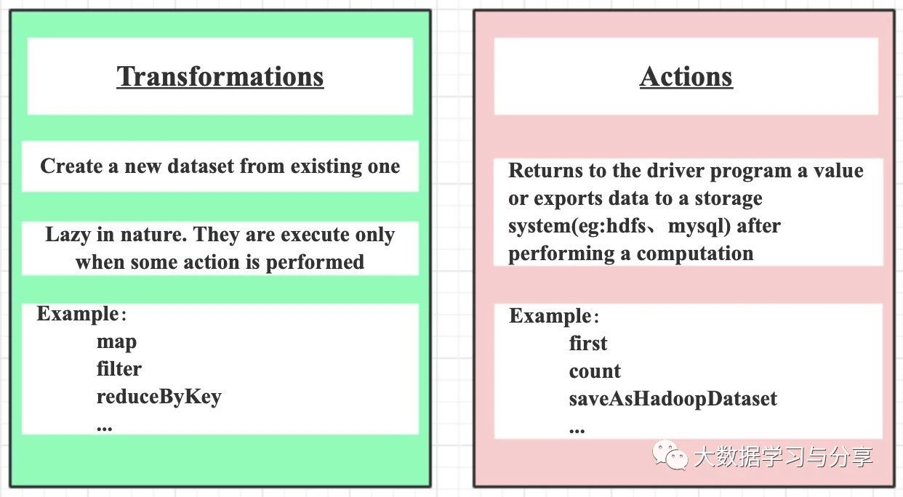

## Spark为什么只有在调用action时才会触发任务执行呢（附算子优化和使用示例）？

Spark算子主要划分为两类：transformation和action，并且只有action算子触发的时候才会真正执行任务。还记得之前的文章[《Spark RDD详解》](https://mp.weixin.qq.com/s/ZzTxTLlcgwQPhysuxN0iRQ)中提到，Spark RDD的缓存和checkpoint是懒加载操作，只有action触发的时候才会真正执行，其实不仅是Spark RDD，在Spark其他组件如SparkStreaming中也是如此，这是Spark的一个特性之一。像我们常用的算子map、flatMap、filter都是transformation算子，而collect、count、saveAsTextFile、countByKey、foreach则为action算子。


<p align="center">

</p>

但初学Spark的人往往都会有这样的疑惑，为什么Spark任务只有在调用action算子的时候，才会真正执行呢？咱们来假设一种情况：假如Spark中transformation直接触发Spark任务！那么会产生什么结果呢？

1. 导致map执行完了要立即输出，数据也必然要落地（内存和磁盘）

2. map任务的生成、调度、执行，以及彼此之间的rpc通信等等，当牵扯到大量任务、大数据量时，会很影响性能

看到这两点是不是很容易联想到MapReduce的计算模型，MapReduce因为中间结果需要落地，导致性能相对Spark较低下，这也是MapReduce广为诟病的原因之一。所以Spark采用只有调用action算子时才会真正执行任务，这是相对于MapReduce的优化点之一。

但是每个Spark RDD中连续调用多个map类算子，Spark任务是对数据在一次循环遍历中完成还是每个map算子都进行一次循环遍历呢？

答案很确定：不需要对每个map算子都进行循环遍历。Spark会将多个map算子pipeline起来应用到RDD分区的每个数据元素上（后续将要介绍的SparkSQL中的Dataset/DataFrame也是如此）

下面说几个算子的优化，这也是面试中经常问的问题：

在我们实际的业务场景中经常会使用到根据key进行分组聚合的操作，当然熟悉Spark算子使用的都知道像reduceByKey、groupByKey、aggregateByKey、combineByKey大多都能满足需求。但是笔者在这里还是要重点说一下，因为很多人想到分组聚合往往第一个想到的算子就是groupByKey，但是groupByKey相对其他算子性能低并且处理不好的情况下，容易发生数据倾斜。所以我们能用其他算子比如reduceByKey替代groupByKey实现满足我们业务需求的，就一律不用groupByKey。当然reduceByKey在某些场景下性能会比aggregateByKey低，具体算子的替换要结合实际业务需求场景来定。

这里主要说明一下reduceByKey和groupByKey的对比，以及几个算子替代的场景示例：

1. 首先这几个“ByKey”的算子会触发shullfe，这里强调一点，对于分布式任务，如果存在聚合操作的话往往都是要进行shuffle的

2. 相对于reduceByKey，groupByKey没有预先聚合，而是直接将相同key的value进行分组然后再聚合造成shuffle耗费严重；而reduceByKey会先在map端进行局部聚合，然后再在reduce端再次聚合，这点类似于MapReduce中combiner组件，可以减少磁盘IO和网络IO，提高性能

3. aggregateByKey替代reduceByKey的场景：当输出的结果和输入的结果不同的时候可以被替换。例如，查找同一个key的所有不同的value值，也即是先根据key进行分组，然后去重。假设采用reduceByKey实现的话，需要先用map讲单个元素装到set里，然后在针对set进行reduceByKey，伪代码：rdd.map(case(k,v) => (k, Set(v))).reduceByKey(_ ++ _)，但是该过程会导致为每个记录创建一个set，这是很没必要的。此时我们可以使用aggregateByKey替代reduceByKey实现该需求，伪代码：

```
val zero = mutable.Set[String]()
rdd.aggregateByKey(zero)((set, v) => set += v,(set1, set2) => set1 ++= set2)。
```
具体示例：

1）reduceByKey

```
val rdd = rowRdd.map { row =>

      val id = row.getAs[String]("id")

      val name = row.getAs[String]("name")

      val count = row.getAs[Long]("count")

      (id, (name, count))
    }.map { case (id, (name, count)) => (id, Array(count)) }.reduceByKey(_ ++ _)
```

2）aggregateByKey

```
 val zeroValue = mutable.Set[(String, Long)]()

 val rdd = df.rdd.map { row =>

      val id = row.getAs[String]("id")

      val name = row.getAs[String]("name")

      val count = row.getAs[Long]("count")

      (id, (name, count))

 }.aggregateByKey(zeroValue)(

      (set, v) => set += v,
      (set1, set2) => set1 ++= set2)

```

3）combineByKey

```
val rdd = df.rdd.map { row =>

      val id = row.getAs[String]("id")

      val name = row.getAs[String]("name")

      val count = row.getAs[Long]("count")

      (id, (name, count))

}.combineByKey(

      (v: (String, Long)) => List(v),

      (c: List[(String, Long)], v: (String, Long)) => v :: c,

      (c1: List[(String, Long)], c2: List[(String, Long)]) => c1 ::: c2)
```

4．当两个数据集已经按照key进行分组，此时想对两个数据集在仍然保持分组的基础上进行join，则可以使用cgroup，以避免分组展开然后再次分组的开销

Spark目前提供了80多种算子，想熟练掌握这些算子如何运用，笔者建议学习一下Scala语言，原因除了[《Spark通识》](https://mp.weixin.qq.com/s/hpCpD_8Q5CxCdUlF8oHFkQ)中说的那两点之外，还有就是Spark提供的很多算子跟Scala本身提供的函数功能很相似甚至有些名字都是一样的，了解了Scala提供的，对于学习Spark算子将事半功倍。这里举一些常用的transformation和action使用示例：

### transformation

* map

map是对RDD中的每个元素都执行一个指定的函数来产生一个新的RDD。任何原RDD中的元素在新RDD中都有且只有一个元素与之对应。

举例：

```
val a = sc.parallelize(1 to 9, 3)

val b = a.map(x => x*2)

a.collect 【Array[Int] = Array(1, 2, 3, 4, 5, 6, 7, 8, 9)】
b.collect 【Array[Int] = Array(2, 4, 6, 8, 10, 12, 14, 16, 18)】
```

* filter

filter是对RDD中的每个元素都执行一个指定的函数来过滤产生一个新的RDD，该RDD由经过函数处理后返回值为true的输入元素组成。任何原RDD中的元素在新RDD中都有且只有一个元素与之对应。

```
val rdd = sc.parallelize(List(1,2,3,4,5,6))

val filterRdd = rdd.filter(_ > 3)
filterRdd.collect() 【返回所有大于3的数据的：Array(6,8,10,12)】
```

* flatMap

与map类似，区别是原RDD中的元素经map处理后只能生成一个元素，而原RDD中的元素经flatmap处理后可生成多个元素来构建新RDD。举例：对原RDD中的每个元素x产生y个元素（从1到y，y为元素x的值）

```
val a = sc.parallelize(1 to 4, 2)

val b = a.flatMap(x => 1 to x)
b.collect 【Array(1, 1, 2, 1, 2, 3, 1, 2, 3, 4)】
```

* reduceByKey和sortByKey

分组聚合与排序，这里以单词统计，并按单词排序为例

```
val rdd1 = sc.parallelize(List(("tom", 1), ("jerry", 3), ("kitty", 2), ("shuke", 1)))

val rdd2 = sc.parallelize(List(("jerry", 2), ("tom", 3), ("shuke", 2), ("kitty", 5)))

val rdd3 = rdd1.union(rdd2)

//按key进行聚合（PairRDDFunctions提供）

val rdd4 = rdd3.reduceByKey(_ + _)

//false降序，默认true（OrderedRDDFunctions提供）

val rdd5 = rdd4.sortByKey(false)

```

* repartition

该函数其实就是coalesce函数第二个参数为true的实现，改变分区数会产生shuffle，repartition之后会返回一个新的RDD

```
var data = sc.parallelize(1 to 12, 3) //分区数3

var rdd1 = data.repartition(1) //分区数1

var rdd1 = data.repartition(4) //4
data.partitions.size 还是3
```

### action

* first

first返回RDD中的第一个元素，不排序。

```
var rdd1 = sc.makeRDD(Array(("A","1"),("B","2"),("C","3")),2)

rdd1.first 【 (A,1) 】

var rdd1 = sc.makeRDD(Seq(10, 4, 2, 12, 3))
rdd1.first 【 10 】
```

* count

count返回RDD中的元素数量。

```
var rdd1 = sc.makeRDD(Array(("A","1"),("B","2"),("C","3")),2)
rdd1.count 【 3 】
```

* take

take用于获取RDD中从0到num-1下标的元素，不排序。

```
var rdd1 = sc.makeRDD(Seq(10, 4, 2, 12, 3))
rdd1.take(1) 【 Array(10) 】
rdd1.take(2) 【 Array(10, 4) 】
```

像各种save操作，如saveAsNewAPIHadoopDataset都是action算子，这里就不一一列举了。


### [阅读原文](https://mp.weixin.qq.com/s/tHOMvAkloboyCu9zYKuSCw)