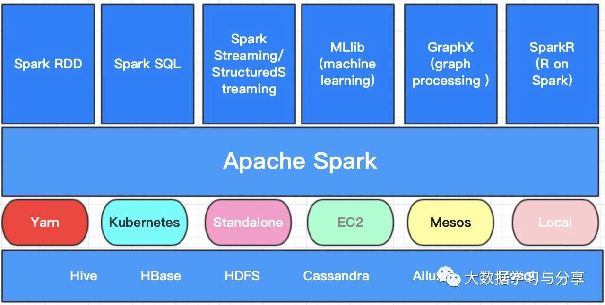

## Spark 通识

在说Spark之前，笔者在这里向对Spark感兴趣的小伙伴们建议，想要了解、学习、使用好Spark，Spark的官网是一个很好的工具，几乎能满足你大部分需求。同时，建议学习一下Scala语言，主要基于两点：   
1. Spark是Scala语言编写的，要想学好Spark必须研读分析它的源码, 当然其他技术也不例外   
2. 用Scala语言编写Spark程序相对于用Java更方便、简洁、开发效率更高（后续我会针对scala语言做单独讲解） 
 
书归正传，下面整体介绍一下Spark生态圈：

Apache Spark是一种快速、通用、可扩展、可容错的、基于内存迭代计算的大数据分析引擎。首先强调一点，Spark目前是一个处理数据的计算引擎，不做存储。首先咱们通过一张图来看看目前Spark生态圈都包括哪些核心组件：

本篇文章先简单介绍一下各个组件的使用场景，后续笔者会单独详解其中的核心组件，以下所讲均基于Spark2.X版本。 

### Spark RDD和Spark SQL

Spark RDD和Spark SQL多用于离线场景，但Spark RDD即可以处理结构化数据也可以处理非结构数据，但Spark SQL是处理结构化数据的，内部通过dataset来处理分布式数据集

### SparkStreaming和StructuredStreaming

用于流式处理，但强调一点Spark Streaming是基于微批处理来处理数据的，即使Structured Streaming在实时方面作了一定优化，但就目前而言，相对于Flink、Storm，Spark的流式处理准备确实准实时处理

### MLlib

用于机器学习，当然pyspark也有应用是基于python做数据处理

### GraphX

用于图计算

### Spark R

基于R语言进行数据处理、统计分析的

## Spark的特性

* 快
 
	实现DAG执行引擎，基于内存迭代式计算处理数据，Spark可以将数据分析过程的中间结果保存在内存中，从而不需要反复的
从外部存储系统中读写数据，相较于mapreduce能更好地适用于机器学习和数据挖掘和等需要迭代运算的场景。

* 易用

	支持scala、java、python、R多种语言；支持多种高级算子（目前有80多种），使用户可以快速构建不同应用；支持scala、python等shell交互式查询

* 通用

	Spark强调一站式解决方案，集批处理、流处理、交互式查询、机器学习及图计算于一体，避免多种运算场景下需要部署不同集群带来的资源浪费

* 容错性好

    在分布式数据集计算时通过checkpoint来实现容错，当某个运算环节失败时，不需要从头开始重新计算【往往是checkpoint到HDFS上】

* 兼容性强

    可以运行在Yarn、Kubernetes、Mesos等资源管理器上，实现Standalone模式作为内置资源管理调度器，支持多种数据源
    
    
### [阅读原文](https://mp.weixin.qq.com/s/hpCpD_8Q5CxCdUlF8oHFkQ)