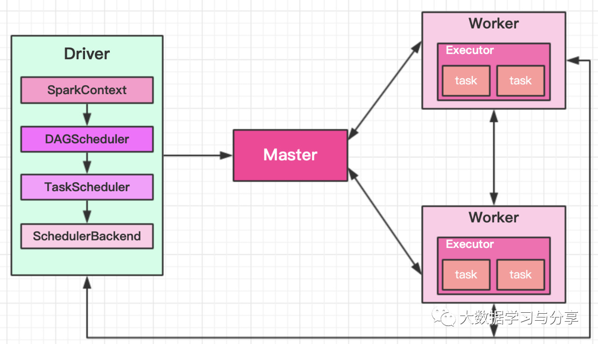
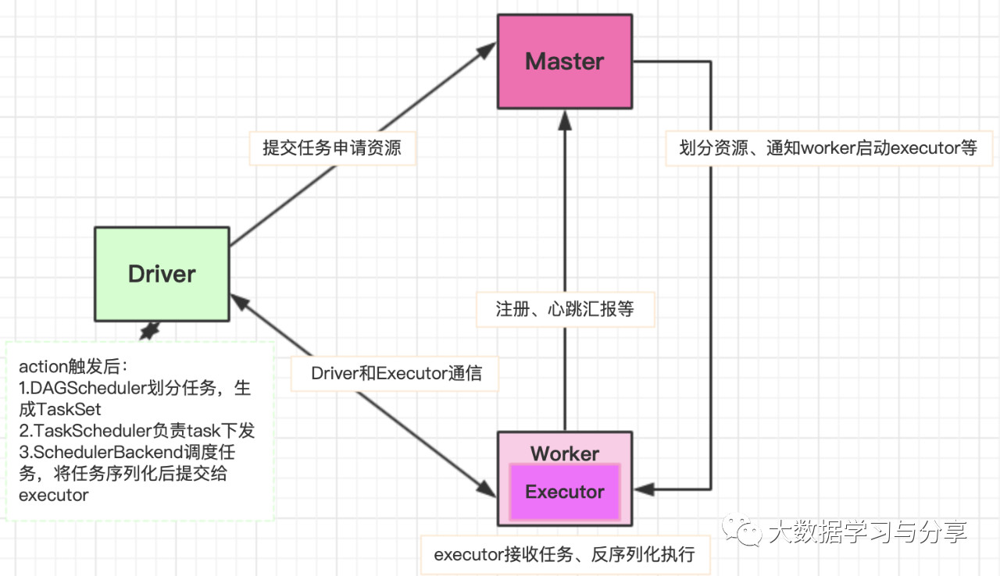

## Spark集群和任务执行

【前言：承接《Spark通识》篇】

### Spark集群组件

Spark是典型的Master/Slave架构，集群主要包括以下4个组件：

Driver：Spark框架中的驱动器，运行用户编写Application 的main()函数。类比于MapReduce的MRAppmaster

Master：主节点，控制整个集群，监控worker。在Yarn模式中为全局资源管理器

Worker：从节点，负责控制计算节点，启动Executor。类比Yarn中的节点资源管理器

Executor：运算任务执行器，运行在worker节点上的一个进程。类似于MapReduce中的MapTask和ReduceTask

### Spark基本执行流程

以StandAlone运行模式为例：

1. 客户端启动应用程序及Driver相关工作，向Master提交任务申请资源

2. Master给Worker分配资源，通知worker启动executor

3. Worker启动Executor，Worker创建ExecutorRunner线程，ExecutorRunner会启动ExecutorBackend进程，Executor和Driver进行通信（任务分发监听等）

4. ExecutorBackend启动后向Driver的SchedulerBackend注册，SchedulerBackend将任务提交到Executor上运行

5. 所有Stage都完成后作业结束

笔者强调：

1. Driver端进行的操作   
   
   a. SparkContext构建DAG图
      
   b. DAGScheduler将任务划分为stage、为需要处理的分区生成TaskSet     
   
   c. TaskScheduler进行task下发     
	
   d. SchedulerBackend将任务提交到Executor上运行

2. 资源划分的一般规则

	a. 获取所有worker上的资源   
	b. 按照资源大小进行排序   
	c. 按照排序后的顺序拿取资源：  i. 轮询	         ii. 优先拿资源多的   

3. Spark不同运行模式任务调度器是不同的，如Yarn模式：yarn-cluster模式为YarnClusterScheduler，yarn-client模式为YarnClientClusterScheduler

### [阅读原文](https://mp.weixin.qq.com/s/okzUEbZbNGlhb7T88xw8uQ)