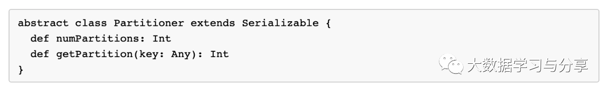

## 聊聊Spark的分区

通过上篇文章【Spark RDD详解】，大家应该了解到Spark会通过DAG将一个Spark job中用到的所有RDD划分为不同的stage，每个stage内部都会有很多子任务处理数据，而每个stage的任务数是决定性能优劣的关键指标。   

首先来了解一下Spark中分区的概念，其实就是将要处理的数据集根据一定的规则划分为不同的子集，每个子集都算做一个单独的分区，由集群中不同的机器或者是同一台机器不同的core进行分区并行处理。

Spark对接不同的数据源，在第一次得到的分区数是不一样的，但都有一个共性：对于map类算子或者通过map算子产生的彼此之间具有窄依赖关系的RDD的分区数，子RDD分区与父RDD分区是一致的。而对于通过shuffle差生的子RDD则由分区器决定，当然默认分区器是HashPartitioner，我们完全可以根据实际业务场景进行自定义分区器，只需继承Parttioner组件，主要重写几个方法即可：

    
以加载hdfs文件为例，Spark在读取hdfs文件还没有调用其他算子进行业务处理前，得到的RDD分区数由什么决定呢？关键在于文件是否可切分：

1.对于可切分文件，如text文件，那么通过加载文件得到的RDD的分区数默认与该文件的block数量保持一致

2.对于不可切分文件，它只有一个block块，那么得到的RDD的分区数默认也就是1

当然，我们可以通过调用一些算子对RDD进行重分区，如repartition。

这里必须要强调一点，很多小伙伴不理解，RDD既然不存储数据，那么加载过来的文件都跑哪里去了呢？这里先给大家提个引子——blockmanager，Spark自己实现的存储管理器。RDD的存储概念其实block，至于block的大小可以根据不同的数据源进行调整，blockmanager的数据存储、传输都是以block进行的。至于block内部传输的时候，它的大小也是可以通过参数控制的，比如广播变量、shuffle传输时block的大小等。

### [阅读原文](https://mp.weixin.qq.com/s/OqOQsSP9q5tGXCEjP8rSPw)