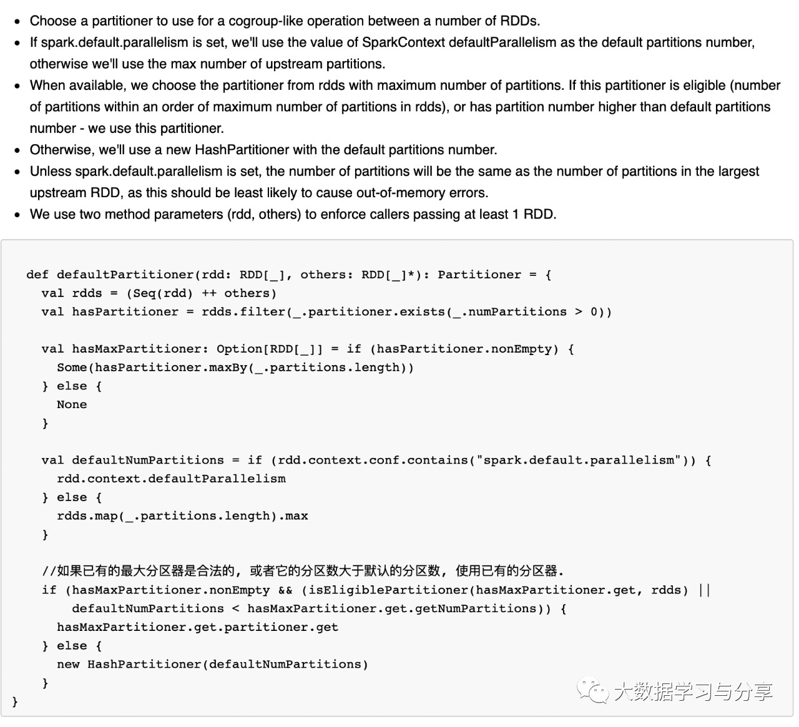

## 通过spark.default.parallelism谈Spark并行度

本篇文章首先通过大家熟知的一个参数spark.default.parallelism为引，聊一聊Spark并行度都由哪些因素决定？

上图是spark官网关于spark.default.parallelism参数说明
    
1.对于reduceByKey和join这些分布式shuffle算子操作，取决于它的父RDD中分区数的最大值
    
2.对于没有父RDD的的算子，比如parallelize，则依赖于集群管理器：1）本地模式：取决于本地机器的核数；2）如果集群管理器是Mesos，则为8；3）其他的：对比所有executor上总核数与2比较，哪个大是哪个

当然上面这些都是默认值，如果我们自己设置了分区数，情况就会有所变化，直接看源码【查看org.apache.spark.Partitioner源码defaultPartitioner方法】

你会发现，如果你使用reducebykey、groupByKey等这些带shuffle的算子，建议不要通过上述方法让程序内部去推测。完全可以通过传入一个确定的分区数或者自己实现一个分区器来做处理。当然这个确定的分区数也不是贸贸然设定的，需要结合你的业务场景根据实际情况来确定多少合适。比如shuffle时流经的数据量，这个就要结合分区数和shuffle总数据量来做适当调整，处理不好的结果极有可能导致数据倾斜等问题...

笔者再次建议，学习Spark一定要研究源码，以及Spark官网http://spark.apache.org/

### [阅读原文](https://mp.weixin.qq.com/s/5Q66oerw6yStT-X607de-g)